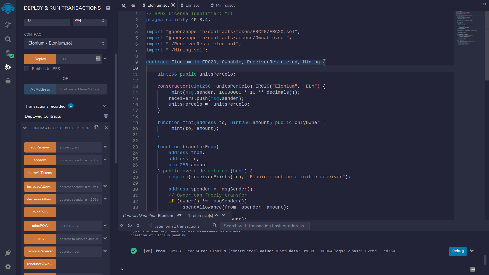
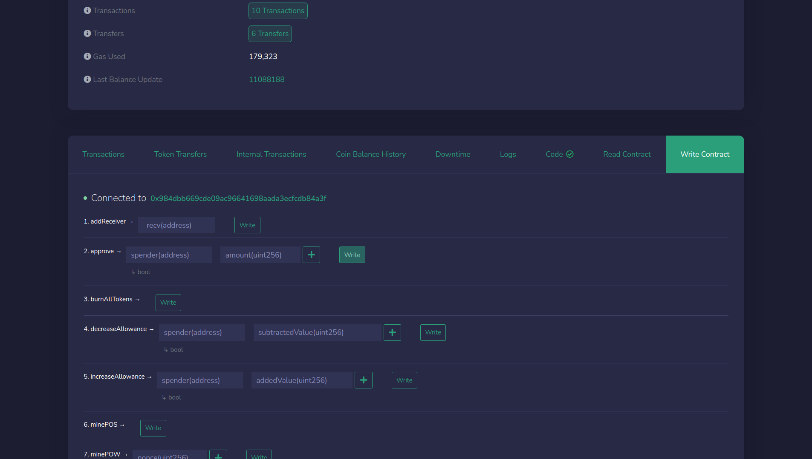
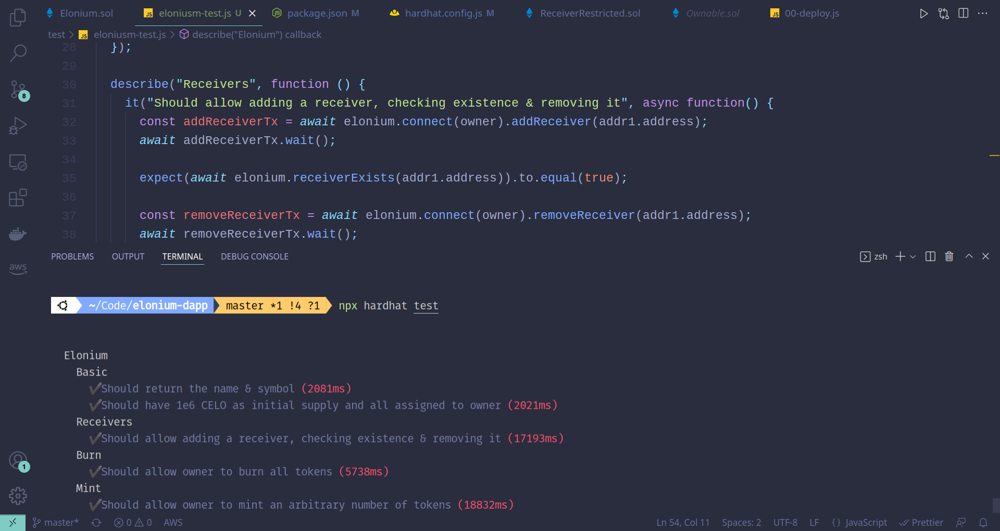

# Elonium



An ERC 20 token deployed on the Celo `alfajores` testnet using `hardhat`, `solidity` & `web3`/`contractkit`. This repository contains smart contracts written in `solidity` and deployment, testing using `hardhat`.

### ~ Features ~

- [X] Owner can mint, burn & transfer tokens arbitrarily
- [X] Transfer occur among receivers in a list only modified by owner
- [X] Users can buy ELM tokens using CELO
- [X] Mining of ELM tokens in Proof of Work process
- [X] Mining of ELM tokens in Proof of Stake process
- [X] Mint an NFT (LORI) with ELM tokens




### ~ Some useful commands ~

```bash
# Setup environment
npm install 

# Deploying the smart contract
npx hardhat --network alfajores deploy

# Verifying the smart contract
npx hardhat --network alfajores sourcify

# Run tests
npx hardhat test
```

### ~ Notes ~

- `.env` contains the following variables
  - `PRIVATE_KEY` - key for an account you own
  - `UNITS_PER_CELO` - amount of ELM for a unit of CELO (default=100 i.e. 0.01 CELO / ELM)
  - `ELM_PER_NFT` - amount of ELM to purchase an NFT (default=100)
- Tests do not have complete coverage; only tests some basic functionality